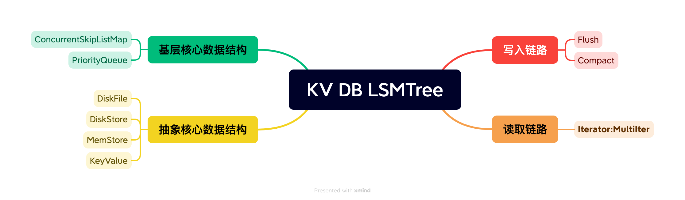

# miniBase 源码阅读笔记
## 前言
MiniBase 主要讲述基本KV 数据结构实现，暂时不涉及软件服务架构层面实现  
结合 LSM Tree 简化版本实现 MemStore + DiskFile,暂时未实现WAL。

**LSM Tree 关键技术：**

## KV 写入链路：
    1. 写逻辑简单，顺序写，吞吐率高
**写入链路**  
本模块主要讲解两个核心动作 Flush、Compact
1. **Flush模块:**<br>
   每次写入都要进行判断： 判断内存文件大小，当超过阀值，就进行Flush <br>
   Flush 将 Snapshot 写入 DiskFile 流程
```java
  try (DiskFileWriter writer = new DiskFileWriter(fileTempName)) {
     while (it.hasNext()) {
         writer.append(it.next());
     }
     writer.appendIndex();
     writer.appendTrailer();
   }
  File f = new File(fileTempName);
  if (!f.renameTo(new File(fileName))) {
  throw new IOException(
  "Rename " + fileTempName + " to " + fileName + " failed when flushing");
  }
  // TODO any concurrent issue ?
  diskStore.addDiskFile(fileName);

```
如以上代码所示: <br>
进行Flush 的时候在DiskStore类flush方法中调用 DiskFileWriter类：<br>
DiskFileWriter类包含了BlockWriter,BlockIndexWriter,Trailer 写入，<br>
其中都是通过 FileOutputStream 实现写入具体DiskFile 文件.

1. BlockWriter      直接写入数据块
2. BlockIndexWriter 根据数据写入索引块：主要包含BloomFilter
3. Trailer          默认文件结束符 <br>
   Trailer 默认组成 fileSize(8B)+ blockCount(4B) + blockIndexOffset(8B) + blockIndexOffset(8B) + DISK_FILE_MAGIC(8B)


**2.Compact模块:**

在MStore 构造函数中默认开启Compact 线程后端进行DiskFile 合并，<br>
具体实现类 在DiskStore内部类DefaultCompactor中核心方法如下:

```java
private void performCompact(List<DiskFile> filesToCompact) throws IOException {
      String fileName = diskStore.getNextDiskFileName();
      String fileTempName = fileName + FILE_NAME_TMP_SUFFIX;
      try {
        try (DiskFileWriter writer = new DiskFileWriter(fileTempName)) {
          for (Iter<KeyValue> it = diskStore.createIterator(filesToCompact); it.hasNext();) {
            writer.append(it.next());
          }
          writer.appendIndex();
          writer.appendTrailer();
        }
        File f = new File(fileTempName);
        if (!f.renameTo(new File(fileName))) {
          throw new IOException("Rename " + fileTempName + " to " + fileName + " failed");
        }

        // Rename the data files to archive files.
        // TODO when rename the files, will we effect the scan ?
        for (DiskFile df : filesToCompact) {
          df.close();
          File file = new File(df.getFileName());
          File archiveFile = new File(df.getFileName() + FILE_NAME_ARCHIVE_SUFFIX);
          if (!file.renameTo(archiveFile)) {
            LOG.error("Rename " + df.getFileName() + " to " + archiveFile.getName() + " failed.");
          }
        }
        diskStore.removeDiskFiles(filesToCompact);

        // TODO any concurrent issue ?
        diskStore.addDiskFile(fileName);
      } finally {
        File f = new File(fileTempName);
        if (f.exists()) {
          f.delete();
        }
      }
    }

```
核心逻辑：  
1. 扫描DiskFile存储的目录：filesToCompact = diskStore.getDiskFiles() 传递需要合并的小文件  
2. 然后构建 **diskStore.createIterator()** 迭代器  
   createIterator 返回 MultiIterator,归并排序中采用 PriorityQueue 优先级排序队列实现  
   详细细节在 MultiIterator 核心数据结构部分讲述。  
3. 通过 For 循环全局有序写入同一个 DiskFile 中，写入算法类似Flush:  
   伪代码
   ```java
   for(iter.hasNext()){  
     writer.append(it.next());  
   }
   writer.appendIndex();  
   writer.appendTrailer();
   ```  


QA:
1. 归并排序实现思路？
2. 如何保证文件有序并且数据不重复
   1. 暂时从 compact 链路没有找到多版本去重逻辑 待进一步确认


## KV 查询链路
    1. 查询逻辑复杂，重点是 Iter 高效实现，如何快速定位 Key 位置
    2. 核心看Scan 过程 <-----> 对应HBase 实际实现 <br>
    3. BloomFilter <br>
    4. Seek HFile【多版本影响查询CPU】<br>

## 核心数据结构
    1. KeyValue:
    2. DiskFile:
    3. MemStore： 主要存储对象是 MemStore ，通过内存councurrent_list 存储，算法动作是Flush 操作
    4. DiskStore：  主要存储对象是 DiskFile 文件结构 ,算法动作是Compact
    5. MStore:  继承实现 MiniBase, 启动compact 守护线程


**核心数据结构MultiIter 代码解释**  
核心数据结构  
IterNode：                      存储从MemStore or DiskFile 获取的迭代器及第一个KV保存在此数据结构中  
PriorityQueue<IterNode> queue： 存储的是每一个迭代器对象，优先级按照第一个元素进行对比，


核心算法

构造函数：  
通过kv.compareTo 当作比较器，「比较逻辑补充」，初始化 PriorityQueue 队列 
```java
public MultiIter(SeekIter<KeyValue> iters[]) throws IOException {
      assert iters != null;
      this.iters = iters; // Used for seekTo
      this.queue = new PriorityQueue<>(((o1, o2) -> o1.kv.compareTo(o2.kv)));//Lambda 格式调用KeyValue 数据结构中的compareTo方法给定顺序
      for (int i = 0; i < iters.length; i++) {
        if (iters[i] != null && iters[i].hasNext()) {
          queue.add(new IterNode(iters[i].next(), iters[i]));//拿到每一个迭代器(MemStore or DisFile 的迭代器)的第一个元素 + 迭代器对象，在 PriorityQueue 进行排序
        }
      }
    }
```

Next()：  
保障每次按照字典序取KV元素，然后重新加入queue ，从而确保全局有序。  
此处也就是多文件归并排序实现的经典Demo。
```java
public KeyValue next() throws IOException {
      while (!queue.isEmpty()) {
        IterNode first = queue.poll();
        if (first.kv != null && first.iter != null) {
          if (first.iter.hasNext()) {// 每次queue.poll() 之后，需要按照每个迭代器 第一个元素进行重新排序，始终保障取数有价值
            queue.add(new IterNode(first.iter.next(), first.iter));
          }
          return first.kv;
        }
      }
      return null;
    }
```
SeekTo(kv):  
每一个迭代器Seek 到指定位置，重新排序加入 queue ，从而确保全局有序。  
```java
public void seekTo(KeyValue kv) throws IOException {
      queue.clear();
      for (SeekIter<KeyValue> it : iters) {
        it.seekTo(kv);
        if (it.hasNext()) {
          // Only the iterator which has some elements should be enqueued.
          queue.add(new IterNode(it.next(), it));
        }
      }
    }
```


## 核心算法实现：
1. 查询/Compact/Flush 均需要使用的核心逻辑  
a. Iter<KeyValue>: 在MiniBase 中定义此接口，后续封装实现haseNext,next 等来完成查询数据  
b. MultiIter： 整个KV查询逻辑的关键，scan 查询直接调用，其中it.seekTo() 指定查询起点  
c. SeekIter: 直接定位到指定位置，在MStore 中定义此接口， 具体实现是在MemStore 和 DiskFile 中实现  
d. InternalIterator: 在DiskFile中实现，主要是根据起始点定位key  


# TODO-LIST
**写入链路**

**读取链路**

整体QA回答


